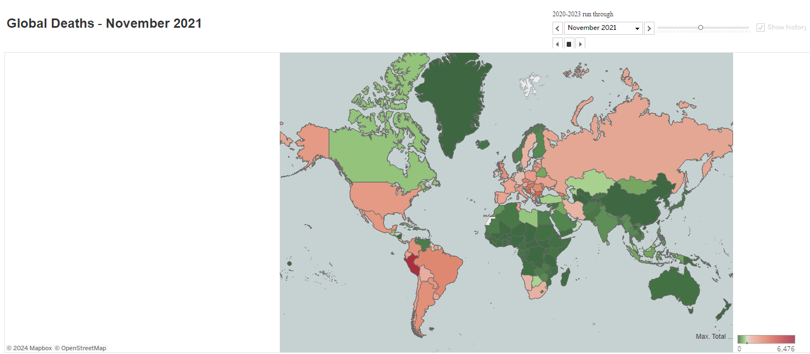
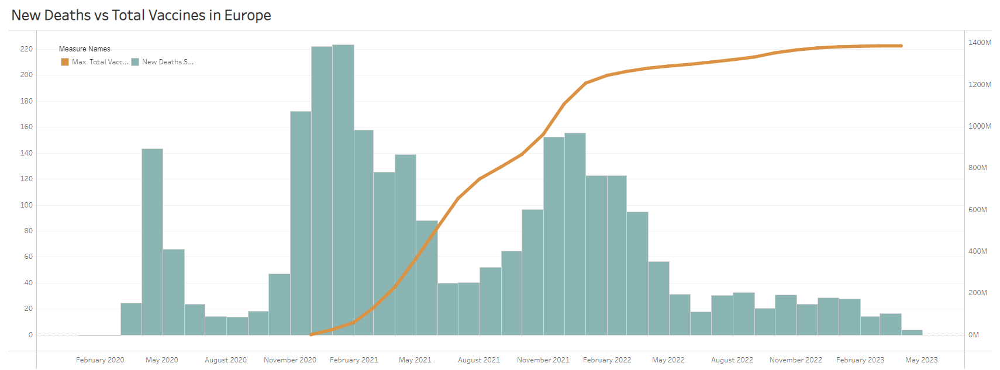

# Covid Impact Analysis

**Date: May 2024**

| Platform      | Link                                                                                                                                    |
|---------------|-----------------------------------------------------------------------------------------------------------------------------------------|
| Tableau       | [Covid Impact Analysis](https://public.tableau.com/app/profile/pinar.gibson/viz/Covid_17195726459090/CovidAnalysis)          |

We conducted a comprehensive data visualization project to determine where the coronavirus situation was the worst globally.

The primary objective was to produce a piece of data journalism that clearly communicated the most important messages about the current impact of the disease across the world. The analysis included creating interactive and informative visuals, dashboards, and a cohesive story using Tableau.

**Structure of the Project:**

- Loaded and cleaned the COVID-19 dataset from Our World in Data.
- Created various graphics and visuals to tell the story effectively.
- Developed dashboards and stories in Tableau to support the narrative.
- Included interactive elements to allow users to explore the data without overwhelming them.

This experience developed my skills in data visualization, storytelling, and using Tableau for creating impactful presentations.

**Key Insights Derived from the Analysis:**

- Identification of regions with the highest COVID-19 impact based on various metrics.
- Analysis of the relation between vaccination rates and the death rates.
- Insights into the common characteristics of the most affected countries.

**Skills:** Data Visualization · Tableau · Data Cleaning · Data Analysis · Storytelling
