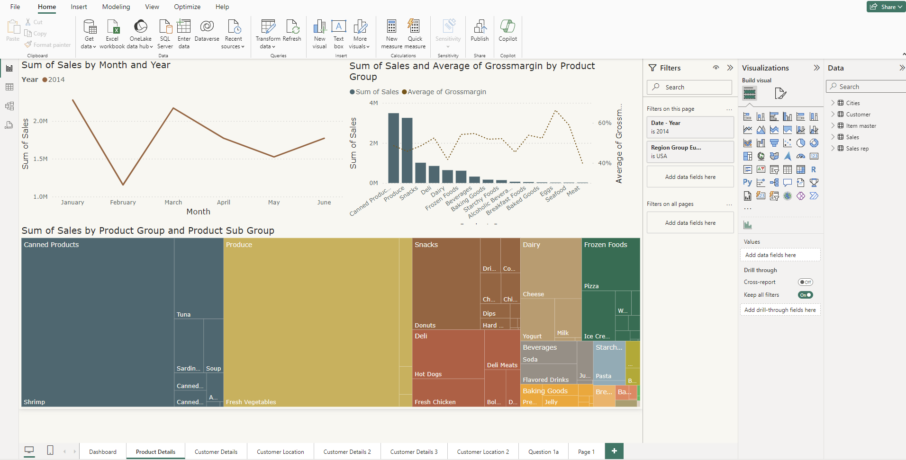
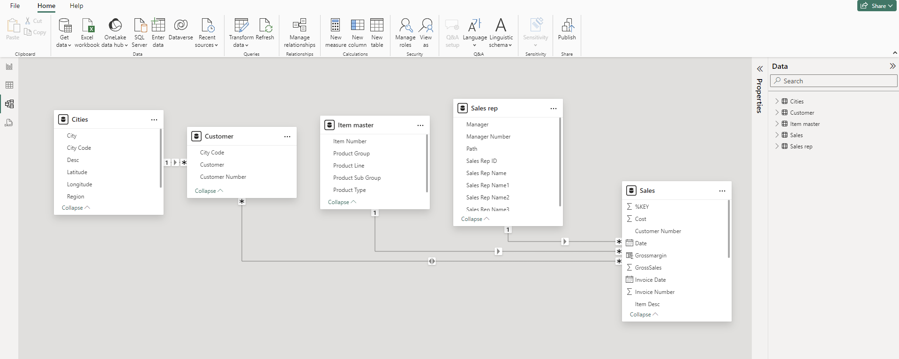

# Sales Analysis for Global Food Distribution Company

**Apr 2024**

| Platform     | Link                                                                                                                                    |
|--------------|-----------------------------------------------------------------------------------------------------------------------------------------|
| Project Document | [Link to Project Document](https://docs.google.com/document/d/1gvgD9IVmgHYiKCW_ee4XHa1jNAW6bbZc) |

Analysis of sales data from 2012 to 2014 to provide valuable insights into the client's products, sales, and marketing strategies, used Power Query to transform the data and visualised with Power BI.

**Skills:** Microsoft Power Query · Power BI · Data Modelling