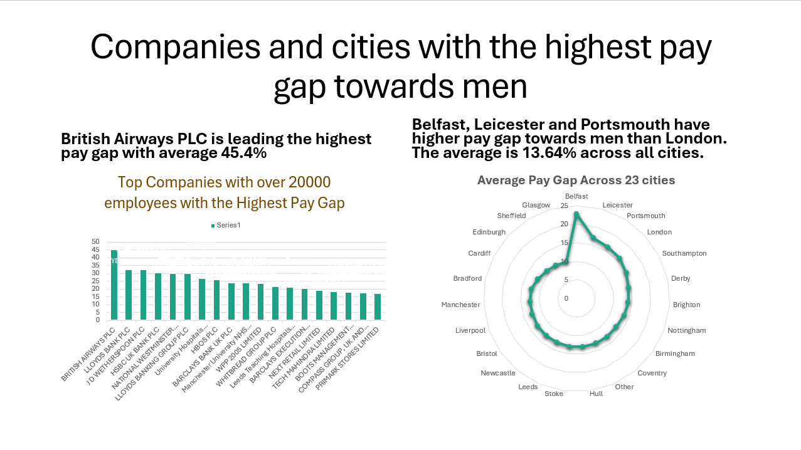
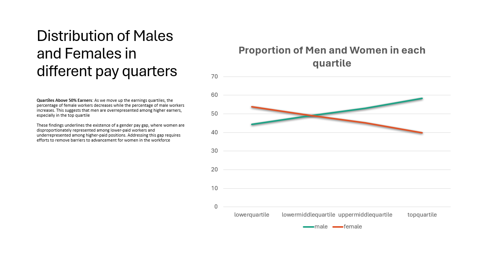

# Gender Pay Gap Analysis

**Apr 2024**

| Platform     | Link                                                                                                                                    |
|--------------|-----------------------------------------------------------------------------------------------------------------------------------------|
| Google Slides| [Gender Pay Gap Analysis Presentation](https://docs.google.com/presentation/d/1i8z-HDBsXWMSoHJqmJu-KBiFs8sMhXtx/edit#slide=id.p4)       |
| Tableau      | [Gender Pay Gap Analysis Dashboard](https://public.tableau.com/app/profile/pinar.gibson/viz/gpd_17141490370480/Dashboard1)              |

Conducted a comprehensive analysis of the UK gender pay gap using a gov.uk dataset. Utilised SQL for data extraction, cleaning, and wrangling. Created Excel visualisations to identify average pay gaps across sectors, top companies and cities with the highest gaps, pay gap distribution by company size, and gender distribution across pay quarters. Presented findings in PowerPoint and recreated visualisations in Tableau.

[](img/gender1.png "Gender 1" data-lightbox="image-12")

[](img/gender2.png "Gender 2" data-lightbox="image-13")


**Skills:** Microsoft Excel · Data Analytics · Microsoft PowerPoint · SQL

## Example Queries

### What is the average pay gap for companies across the UK?

```sql
SELECT 
ROUND(AVG(diffmeanhourlypercent), 2) as avg_mean_diff
FROM gender_pay_gap_21_22;
```

### Average pay gap by employer size

```sql
SELECT employername,
employersize,
AVG(diffmeanhourlypercent) FILTER (WHERE employersize IN ('Less than 250','250 to 499', '500 to 999', '1000 to 4999', '5000 to 19,999', '20,000 or more')) as avg_within_range
FROM gender_pay_gap_21_22
WHERE employersize NOT LIKE 'Not Provided'
GROUP BY 1, 2
ORDER BY 3 DESC;
```

### Average pay gap by employer name and size

```sql
SELECT employername,
employersize,
AVG(diffmeanhourlypercent) FILTER (WHERE employersize IN ('Less than 250','250 to 499', '500 to 999', '1000 to 4999', '5000 to 19,999', '20,000 or more')) as avg_within_range
FROM gender_pay_gap_21_22
WHERE employersize NOT LIKE 'Not Provided'
GROUP BY 1, 2
ORDER BY 3 DESC;
```

### Differences between the average pay gaps across industries

```sql
SELECT DISTINCT SPLIT_PART(siccodes, ',', 1) AS first_siccode,
ROUND(AVG(diffmeanhourlypercent), 2) as avg_mean_diff,
employersize
FROM gender_pay_gap_21_22
GROUP BY 1, 3
ORDER BY 2 DESC;
```

### Average pay gap by area

```sql
SELECT
    area,
    ROUND(AVG(diffmeanhourlypercent), 2) AS avg_pay_gap
FROM
    (
    SELECT
        CASE
            WHEN address LIKE '%London,%' THEN 'London'
            WHEN address LIKE '%Birmingham,%' THEN 'Birmingham'
            WHEN address LIKE '%Glasgow,%' THEN 'Glasgow'
            WHEN address LIKE '%Liverpool,%' THEN 'Liverpool'
            WHEN address LIKE '%Bristol,%' THEN 'Bristol'
            WHEN address LIKE '%Manchester,%' THEN 'Manchester'
            WHEN address LIKE '%Sheffield,%' THEN 'Sheffield'
            WHEN address LIKE '%Leeds,%' THEN 'Leeds'
            WHEN address LIKE '%Edinburgh,%' THEN 'Edinburgh'
            WHEN address LIKE '%Leicester,%' THEN 'Leicester'
            WHEN address LIKE '%Coventry,%' THEN 'Coventry'
            WHEN address LIKE '%Bradford,%' THEN 'Bradford'
            WHEN address LIKE '%Cardiff,%' THEN 'Cardiff'
            WHEN address LIKE '%Belfast,%' THEN 'Belfast'
            WHEN address LIKE '%Nottingham,%' THEN 'Nottingham'
            WHEN address LIKE '%Hull,%' THEN 'Hull'
            WHEN address LIKE '%Newcastle,%' THEN 'Newcastle'
            WHEN address LIKE '%Stoke%' THEN 'Stoke'
            WHEN address LIKE '%Southampton,%' THEN 'Southampton'
            WHEN address LIKE '%Derby,%' THEN 'Derby'
            WHEN address LIKE '%Portsmouth,%' THEN 'Portsmouth'
            WHEN address LIKE '%Brighton,%' THEN 'Brighton'
            ELSE 'Other'
        END AS area,
        diffmeanhourlypercent
    FROM
        gender_pay_gap_21_22
    ) AS categorized_data
GROUP BY
    area
ORDER BY 2 DESC;
```

### What are the 10 companies with the largest pay gaps skewed towards men?

```sql
SELECT employername,
diffmeanhourlypercent,
siccodes
FROM public.gender_pay_gap_21_22
ORDER BY 2 DESC
LIMIT 10;
```
