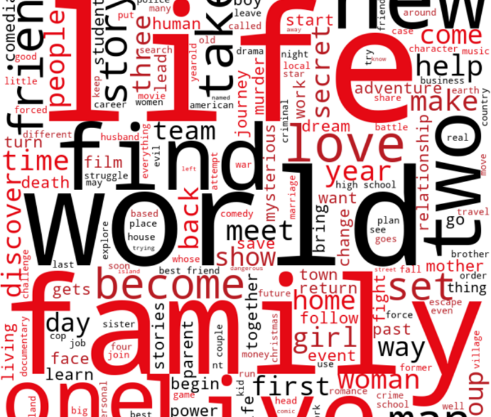
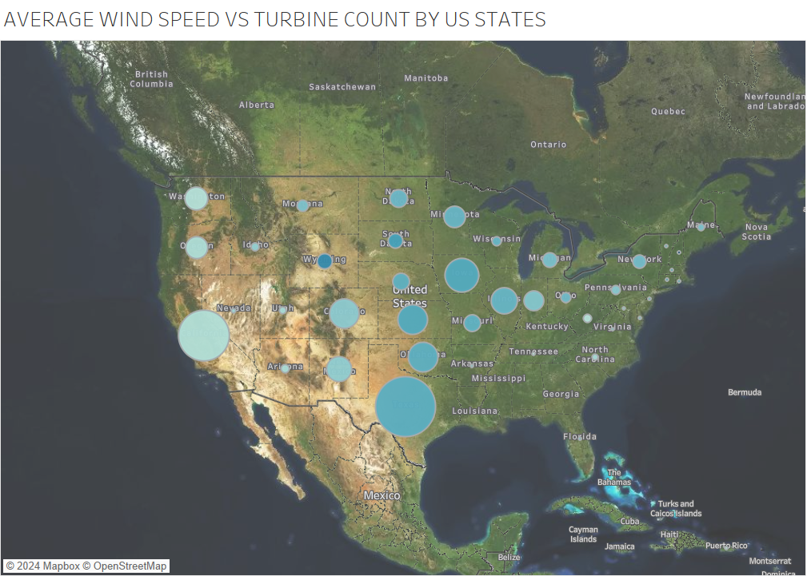
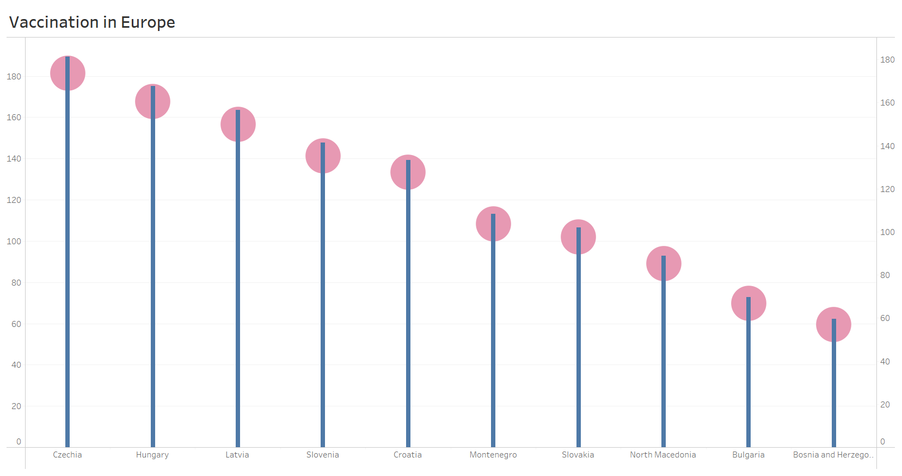
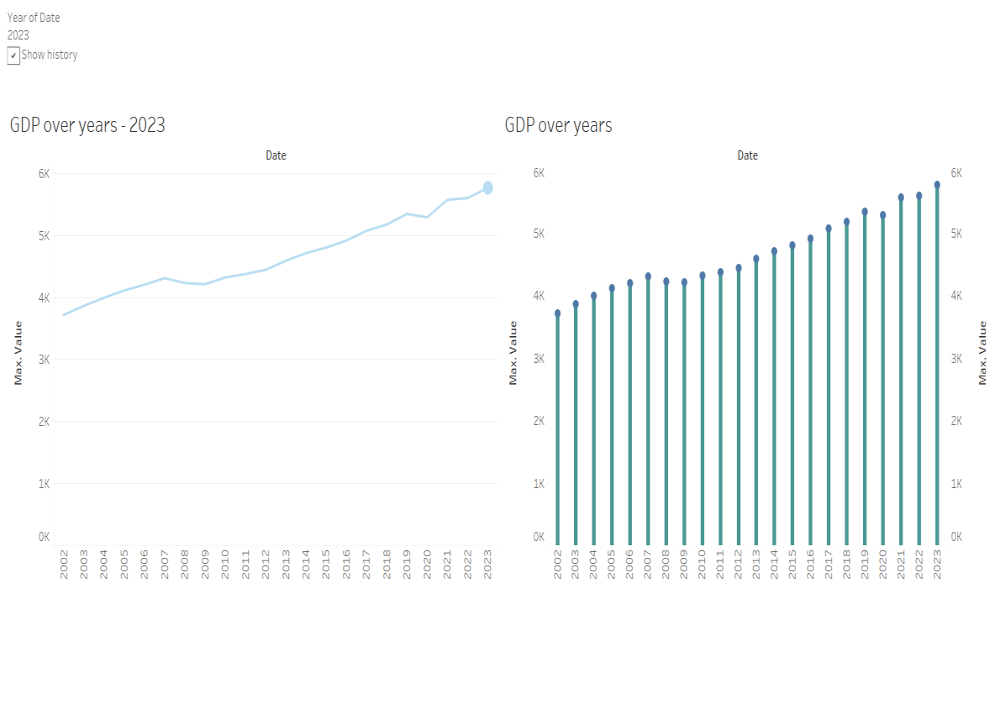
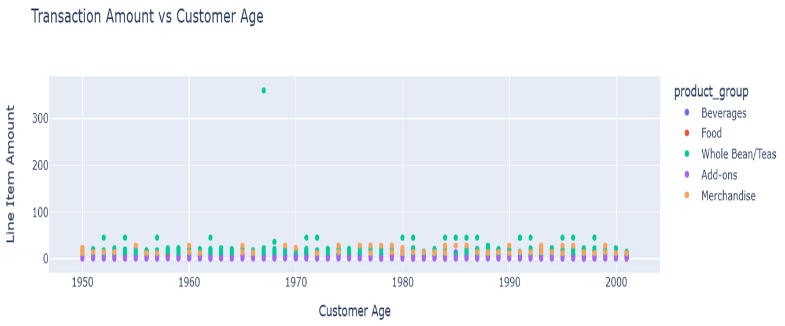
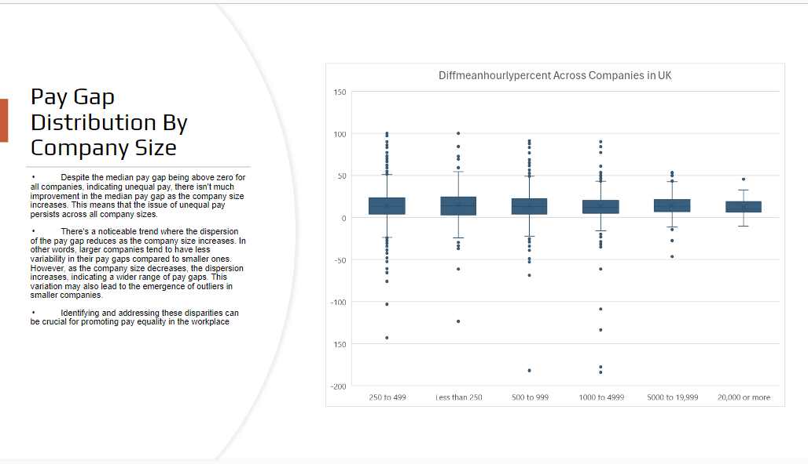
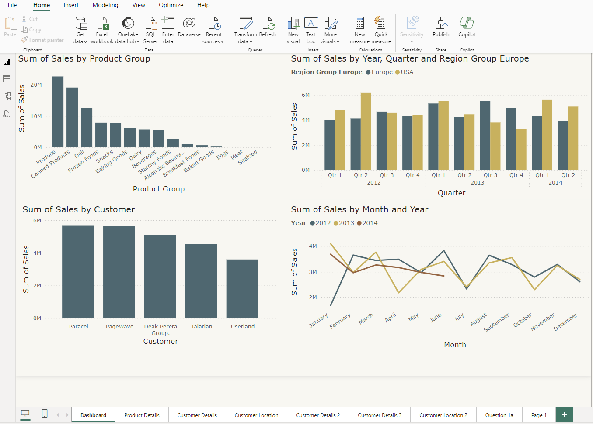
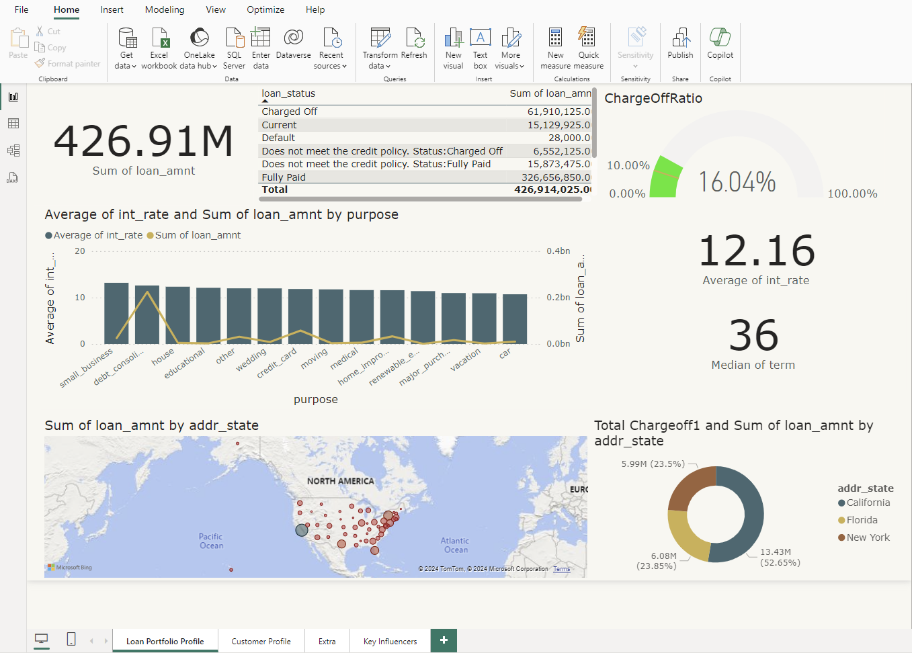
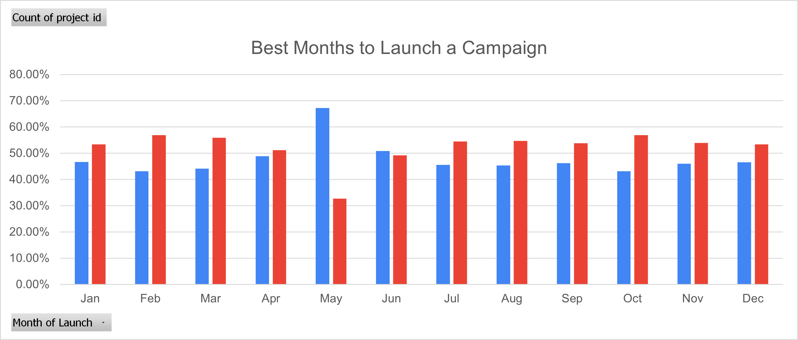

# Projects

---

## [Netflix Content Library Analysis](netflix.md)

**Skills:** Python · Seaborn · Tableau · Data Analytics · SQLite · Web Scraping

---

## [U.S. Wind Turbine Market Analysis](windturbine.md)

**Skills:** Agile Methodologies · Sprint Backlog · Retrospectives · Python · Tableau

---

## [Covid Impact Analysis](covid.md)

**Skills:** Data Visualization · Tableau · Data Cleaning · Data Analysis · Storytelling

---

## [Economic Indicators Analysis](indicators.md)

**Skills:** Data Extraction · Data Wrangling · Python · Jupyter Notebook · Tableau · API Integration

---

## [Coffee Shop Sales Analysis](coffee.md)

**Skills:** Data Wrangling · Data Analysis · Python · Pandas · Plotly · Jupyter Notebook · Data Visualization

---

## [Gender Pay Gap Analysis](gender.md)

**Skills:** Microsoft Excel · Data Analytics · Microsoft PowerPoint · SQL

---

## [Sales Analysis for a Food Distribution Company](food.md)

**Skills:** Microsoft Power Query · Power BI · Data Modelling

---

## [Loan Portfolio Analysis](loan.md)

**Skills:** Data Analytics · Microsoft Power Query · Power BI

---

## [Kickstarter Campaign Success Analysis](kickstarter.md)

**Skills:** Excel Formulas · Microsoft Excel · Data Analytics · Pivot Tables

---