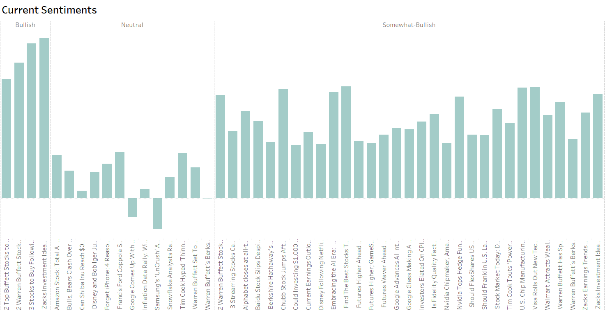

# Economic Indicators Analysis

**Date: May 2024**

| Platform      | Link                                                                                                                                    |
|---------------|-----------------------------------------------------------------------------------------------------------------------------------------|
| Tableau       | [Economic Indicators Analysis - API](https://public.tableau.com/app/profile/pinar.gibson/viz/APIlab_17200059969890/EconomicIndicators)          |

Tasked with analysing the behaviour of various economic indicators during the COVID-19 pandemic years (2020 onwards), I utilised data from Alpha Vantage. This project aimed to provide insights into the economic impact of the pandemic by extracting relevant data and creating detailed visualizations.

**Deliverables:**

1. **Jupyter Notebook:** Completed with Python code to retrieve data from the Alpha Vantage API.
2. **Tableau Workbook:** Visualizations answering the research questions.

**Process and Findings:**

- **Data Extraction and Wrangling:** Utilised Python in Jupyter Notebook to extract data from the Alpha Vantage API. Cleaned and transformed the data to ensure it was suitable for analysis.
- **Analysis and Visualization:** Created visualizations in Tableau to illustrate the behavior of economic indicators.

**Skills:** Data Extraction · Data Wrangling · Data Analysis · Python · Jupyter Notebook · Tableau · API Integration
