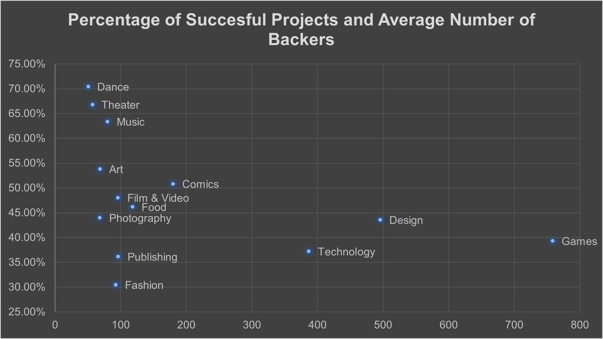
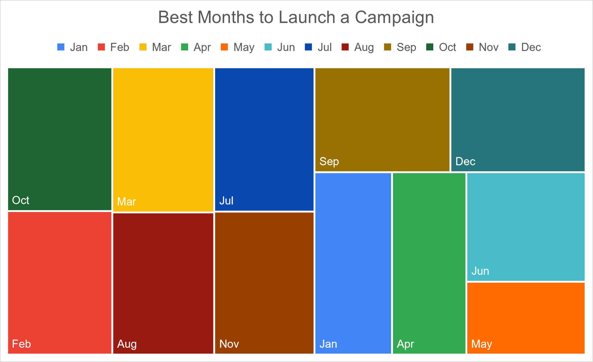
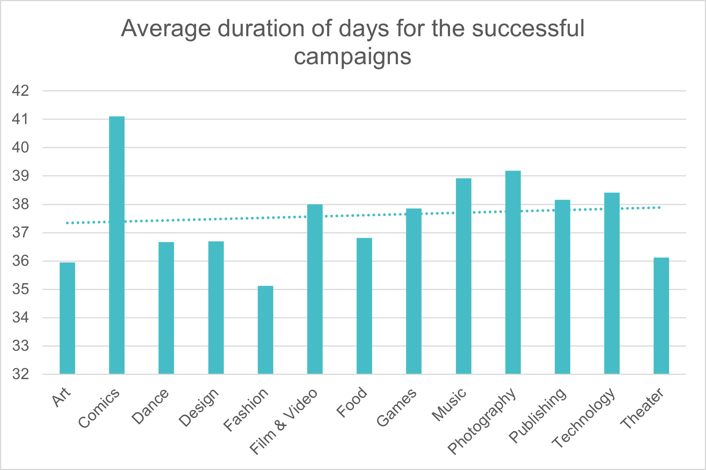
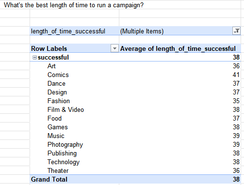
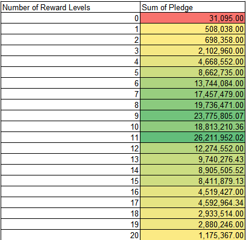

# Kickstarter Campaign Success Analysis

**Date:** April 2024   

Utilised Excel for data cleaning, wrangling, and exploratory analysis. Created visualisations to determine ideal pledge goals, campaign durations, project types, and optimal launch times for successful funding.

**Skills:** Excel Formulas · Microsoft Excel · Data Analytics · Pivot Tables
