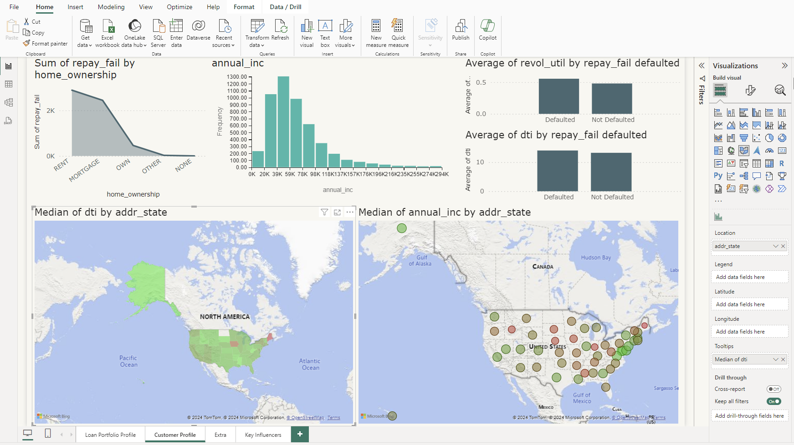
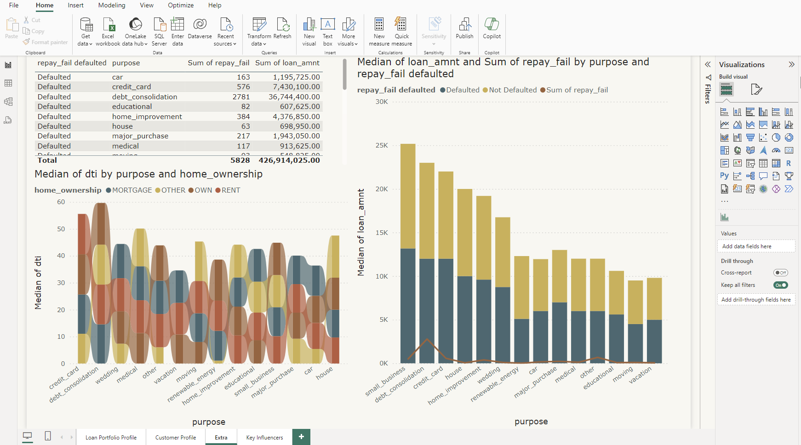

# Loan Portfolio Analysis

**Date:** May 2024  

| Platform     | Link                                                                                                                                            |
|--------------|-------------------------------------------------------------------------------------------------------------------------------------------------|
| Power BI File | [Link to .pbix file](https://drive.google.com/file/d/1lmsLakU2R0b4X09qeSaLhc1qQqHzpo8k/view) |  

Analysed a midsize bank's loan portfolio to determine which types of lending and customer profiles the bank should potentially stop offering or lending to. Utilised Power BI for data cleaning and wrangling. Created interactive dashboards in Power BI to present findings.

**Skills:** Data Analytics · Microsoft Power Query · Power BI  
