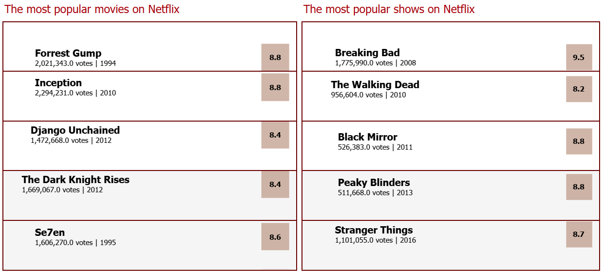

# Netflix Content Analysis

**Jun 2024**

| Platform | Link                                                                                                           |
|----------|----------------------------------------------------------------------------------------------------------------|
| Tableau  | [Netflix Analysis on Tableau](https://public.tableau.com/app/profile/pinar.gibson/viz/Netflix_analysis_17188796913460/Netflixthroughtheyears) |
| GitHub   | [Netflix Analysis on GitHub](https://github.com/PinarGib/Netflix-Analysis)                                     |


Conducted an in-depth analysis of Netflix's content library and user ratings to identify patterns and trends in viewer preferences and what makes a title successful. Key objectives included determining the most popular genres and target age groups across continents, analyzing the performance of original content versus licensed content, and identifying the characteristics of highly-rated titles. The analysis also investigated the distribution of content by release year and the impact of star ratings and vote counts on viewership.

Utilized Python pandas library for data cleaning, preprocessing, and transforming the data, ensuring the data was structured and free of inconsistencies. Employed exploratory data analysis techniques to uncover insights and trends within the dataset. Created visualizations using Plotly, Seaborn, and interactive dashboards using Tableau, enabling dynamic data exploration and presentation of findings. Scraped Wikipedia using Python to identify Netflix Originals, allowing for a boolean classification of titles in the dataset.

[](NetflixDashboard.png "Netflix Dashboard" data-lightbox="image-1")

[](Netflix.png "Netflix" data-lightbox="image-2")

[](netflix1.png "Netflix" data-lightbox="image-3")

**Key insights derived from the analysis include:**

- Identification of top-performing genres and target age groups with their growth trends over time across continents.
- Comparison of user ratings and viewership metrics between Netflix Originals and licensed content.
- Analysis of release year distributions of genres and their correlation with viewer ratings.
- Insights into the attributes of highly-rated content, such as genre, release year, and type (movie or TV show).
- The project provided actionable recommendations for content acquisition and production strategies to optimize viewer engagement and satisfaction.


**Skills:** Python · Seaborn · Tableau · Data Analytics · SQLite · Web Scraping

## Summary of Steps (Python)

### Data Loading and Initial Inspection
- **Loaded the Dataset**: Used `pd.read_csv` to load titles dataset into a DataFrame.
- **Initial Inspection**: Checked the shape, info, and first few rows of the dataset.
- **Descriptive Statistics**: Generated summary statistics for numerical columns.
- **Missing Values Analysis**: Identified columns with missing values.

### Data Cleaning
- **Handled Missing Titles**: Dropped rows with missing titles.
- **Rechecked Missing Values**: Rechecked the missing values after the initial cleaning step.
- **Identified Duplicate Titles**: Identified and handled duplicate titles.

### Data Transformation
- **Exploded the Production Countries Column**: Exploded the production countries column.
- **Mapped Production Countries to Continents**: Mapped production countries to continents.
- **One-Hot Encoded the Genres**: One-hot encoded the genres.
- **Extracted the First Genre**: Extracted the first genre from the genres list.

### Vote Statistics Analysis
- **Calculated Descriptive Statistics**: Calculated descriptive statistics for IMDb votes and scores.
- **Filled Missing IMDb Scores and Votes**: Filled missing IMDb scores and votes with median values.
- **Adjusted IMDb Score Calculation**: Defined and calculated an adjusted IMDb score.
- **Visualized IMDb Votes Distribution**: Plotted a histogram to visualize the distribution of IMDb vote counts.
- **Counted Age Certification Values**: Calculated the counts of each unique value in the `age_certification` column.
- **Rechecked for Missing Values**: Summarized and calculated the percentage of missing values for each column.
- **Handled TV Shows with Missing Seasons**: Identified the number of TV shows with missing seasons.
- **Filtered Titles with Missing Age Certification**: Identified titles with missing values in the `age_certification` column.
- **Categorized IMDb Scores Based on Votes**: Defined and applied a function to categorize titles based on their IMDb votes and adjusted scores.

### Additional Dataset Handling
- **Loaded Additional Datasets**: Loaded related datasets for credits and Netflix originals.
- **Initial Inspection of Credits Dataset**: Performed initial inspection of the credits dataset.
- **Merged Titles and Credits Dataset**: Merged the titles and credits datasets based on the `id` column.
- **Filtered Titles with Missing Person ID**: Identified titles with missing values in the `person_id` column.
- **Added Netflix Original Flag**: Marked titles as Netflix originals and merged this information into the main dataset.
- **Handled Duplicate Entries**: Marked first entry for each title and summed up the IMDb votes based on the first entry.

### Data Export
- **Exported Cleaned Data**: Saved the cleaned and merged dataset to CSV files.

### Wordcloud on Descriptions
- **Installed Necessary Libraries**: Installed libraries needed for wordcloud generation.
- **Imported Required Libraries**: Imported required libraries for wordcloud.
- **Cleaned and Tokenized Text Data**: Cleaned and tokenized text data in the descriptions.
- **Generated and Customized Word Cloud**: Generated and customized a word cloud for visualizing common words in descriptions.

### Exploring Correlations
- Further steps to explore correlations and insights in the data.

## Example SQL Queries

### TOP COUNTRIES BY PRODUCTION COUNT

```sql
SELECT production_countries, 
count(*) As tv_shows_count
FROM titles
GROUP By production_countries
ORDER BY tv_shows_count DESC;
```

### COUNT WHERE PRODUCTION IS ONLY IN GB

```sql
SELECT COUNT(DISTINCT titles.id) AS tv_shows_count, production_countries 
FROM titles
LEFT JOIN credits ON titles.id = credits.id
WHERE titles.production_countries = "['GB']"
GROUP By production_countries;
```

### COUNT WHERE PRODUCTION LIST INCLUDES GB

```sql
SELECT COUNT(DISTINCT titles.id) AS tv_shows_count_GB
FROM titles
LEFT JOIN credits ON titles.id = credits.id
WHERE titles.production_countries LIKE '%GB%';
```

### DISTRIBUTION OF TITLES BY RELEASE YEAR

```sql
SELECT release_year, COUNT(DISTINCT titles.id) AS count 
FROM titles
LEFT JOIN credits ON titles.id = credits.id 
GROUP BY release_year
ORDER BY release_year;
```

### MOST APPEARING ACTOR

```sql
WITH distinct_actors AS (
    SELECT DISTINCT titles.id, credits.name
    FROM titles
    LEFT JOIN credits ON titles.id = credits.id
    WHERE credits.role = 'ACTOR'
)
SELECT name, COUNT(*) AS appearance_count
FROM distinct_actors
GROUP BY name
ORDER BY appearance_count DESC
LIMIT 10;
```

### AVG IMDB SCORE FOR MOVIES AND SHOWS

```sql
WITH distinct_titles AS (
    SELECT DISTINCT titles.id, titles.type, titles.imdb_score
    FROM titles
    LEFT JOIN credits ON titles.id = credits.id
)
SELECT type, AVG(imdb_score) AS avg_imdb_score
FROM distinct_titles
GROUP BY type;
```
