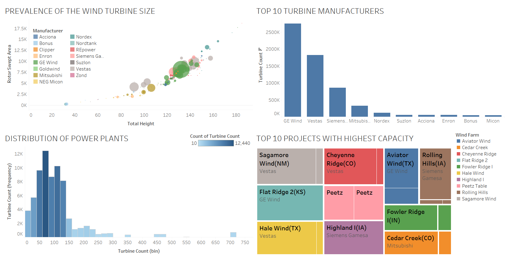

# U.S. Wind Turbine Analysis

**Jun 2024**

| Platform     | Link                                                                                                                                  |
|--------------|---------------------------------------------------------------------------------------------------------------------------------------|
| Google Slides | [U.S. Wind Turbine Analysis Presentation](https://docs.google.com/presentation/d/1dMXvnqeiHUzqBP3hqExM8Gnw40VeYkr0/edit#slide=id.p1)  |
| Tableau  | [U.S. Wind Turbine Analysis on Tableau](https://public.tableau.com/app/profile/pinar.gibson/viz/008_COMPLETED/Dashboard1) |

We analysed wind turbines and operators within the U.S. energy space using Pandas and Plotly libraries in Python, with visualizations created in Tableau. This project was part of a four-day data sprint focused on evaluating investment opportunities for WOW! in the U.S. wind turbine market. The primary objective was to determine whether WOW! should invest in the wind market and identify potential investment areas.

This analysis was conducted under the agile framework, leveraging data analytics workflows to support business decision-making.

**Structure of the Sprint:**

- Instructor assumed the role of product owner, guiding the prioritization of tasks.
- We were provided with a product backlog and estimated efforts for each item.
- A scrum master was designated for our team.
- We established a sprint backlog with high-level milestones for daily completion.
- Developed plans to manage task division and strategy.
- The sprint concluded with a presentation of findings and a retrospective.

This experience enhanced my skills in data analysis, agile project management, and effective teamwork in a high-pressure environment.

**Skills:** Agile Methodologies · Sprint Backlog · Retrospectives · Python · Tableau

